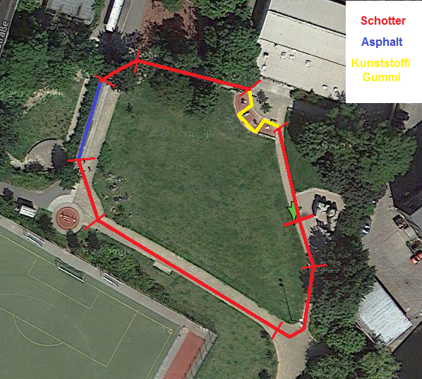

#Challenge 2014-09-26

##Beschreibung

Challenge festgelegt durch: **Julian**

###Vorwort
Ihr seid sicher alle gespannt, was ich mir für die nächste Challenge ausdenke – aber es muss noch ein paar Tage in meinem Kopf reifen...
Nur so viel sei schon mal verraten: Sie soll draußen stattfinden! Damit das auch mit dem Wetter noch was wird, der Abstand zur letzten Challenge aber weder zu klein noch zu groß wird, dachte ich wir streben so Ende September an... 

Nun zur Challenge an sich: (Sorry, dass es so lang geworden ist... :-/ )

###Ort / Strecke:
* ich schlage vor, dass wir die Challenge [hier (grüner Pfeil)](https://maps.google.de/maps?q=52.524479,13.318796) stattfinden lassen.
* Genau dort wo der Pfeil ist, ist eine kleine Anhöhe, von der man die gesamte Strecke gut im Blick hat (siehe rechts; sollten die Büsche an der West-Ecke stören, können wir die Strecke auch über die Wiese führen – vorausgesetzt dort befinden sich keine Tretminen...)
* da wir damit abseits des Labors sind, sind natürlich auch nicht-h2o-Gäste herzlich eingeladen...

*Anmerkung*
* sollte das mit dem Schotter der totale Reinfall sein, so verlegen wir die Challenge auf das Dach des Labors, wo wir einen ähnlichen Streckenverlauf absperren...

###Rennen (ohne Festlegung der Reihenfolge)
1. KO-Rennen (mit Betonung auf "Rennen"; zum Warm werden ;-) ):
  * 1 Runde auf Zeit, alle einzeln nacheinander
  * Auto & Fahrer müssen die Strecke gemeinsam passieren (gelbe Schikane für Fahrer ausgenommen)
  * Start von Auto & Fahrer gleichzeitig, Zeit wird gestoppt, wenn beide (Auto & Fahrer) Ziellinie passiert haben
  * optional: jeder hat 3 Versuche, der beste Versuch zählt – ob die 3 Versuche wahrgenommen werden, kann jeder für sich entscheiden...
  * die Fahrt-Richtung kann (je Versuch) frei gewählt werden
2. KO-Rennen (mit Betonung auf "KO")
  * 5 Runden alle zusammen
  * ab da scheidet jede Runde der letzte aus (also bei 5 Teilnehmern am Ende der 5., 6., 7., 8. Runde; bei 6 entsprechend mehr)
3. Normales Rennen
  * 8 Runden ganz normale, alle zusammen
4. wie 2, nur anders herum
5. wie 3, nur anders herum

###Punktevergabe:
-	Für die Ermittlung des Challenge-Siegers gilt für alle Rennen die gleiche Punktverteilung (Teilnehmerzahl n): 
                1. Platz: n-1 Punkte 
                2. Platz: n-3 Punkte 
                3. Platz: n-4 Punkte 
                n-1. Platz: 0 Punkte 
                n. Platz: 0 Punkte 
                Nicht-Erreichen des Ziels: -1 Punkte (gilt nicht für Rennen 2 & 4 & Mehrfachversuche bei Rennen 1)

###Sonderregeln:
* Während aller Rennen ist das Anfassen der Autos nicht verboten – ist aber an folgende Bedingungen geknüpft:
  * Die Strecke ist in 8 Abschnitte geteilt (siehe Karte: 3 Geraden, 3 Kurven, 1 Schikane, 1 Bodenwell)
  * Das Auto muss nach dem Anfassen an den Anfang des Abschnitts zurückversetzt 
  * Ich glaub das ist Strafe genug, wenn man bedenkt, dass man dafür ohnehin ganz schön wetzen muss...
* In Ermangelung einer Steckdose ist natürlich das Nachladen (und auch Tauschen) des Akkus verboten.
* Im Reparaturfall benötigtes Werkzeug/Ersatzteile ist natürlich mitzubringen...

##Wertung & Teilnehmer

Teilnehmer    | 1 (Zeit)                           | 1 (Pkt.) | 2 (Pl.) | 2 (Pkt.) | 3 (Pl.) | 3 (Pkt.) | 4 (Pl.) | 4 (Pkt.) | 5 (Pl.) | 5 (Pkt.) | Ges. (Pl.) | Ges. (Pkt.) | Punkte | Boni  
------------- | ---------------------------------- | -------- | ------- | -------- | ------- | -------- | ------- | -------- | ------- | -------- | ---------- | ----------- | ------ | ------     
**Jonas**     | 30.4 s 21.6 s **21.1 s**     | 2        | 2       | 2        | 3       | 1        | 1       | 4        | 1       | 4        | 1          | 13          | 4      |   
**Marco**     | **24.7 s** ausgesetzt 27.1 s | 1        | 1       | 4        | 1       | 4        | 2       | 2        | 2       | 2        | 2          | 13          | 2      |            
**Chang-Hae** | 25.3 s 23.2 s **21.0 s**     | 4        | 4       | 0        | 2       | 2        | 3       | 1        | 3       | 1        | 3          | 8           | 1      | + 1 (keine Modifikation)
**Martin**    | 38.6 s ausgesetzt **31.4 s** | 0        | 3       | 1        | -       | -1       | -       | -        | -       | -1       | 4          | -1          | 0      |        
**Julian**    | 44.7 s **39.3 s** 42.1 s     | 0        | 5       | 0        | -       | -1       | 4       | 0        | -       | -1       | 5          | -2          | 0      | + 1 (Design)               

##Rückblick
* Allgemeines
  * Da es dann doch etwas nass war für die Schotterstrecke haben wir uns dafür entschlossen das Rennen doch wieder auf dem Hof stattfinden zu lassen. Der Streckenverlauf und Rennen wurde dabei aber beibehalten.
* Rennen 1
  * Das KO-**Rennen** war so spaßig wie erwartet. Sowohl für die rennenden, als auch für die Zuschauer :-)
  * Marco traut sich nach seinem ersten guten Lauf sogar eine Runde auszusetzen.
  * Martin ist gezwungen auszusetzen, weil er eine kleine Reparatur durchführen muss...
* Rennen 2
  * Marco entscheidet das Rennen knapp für sich...
* Rennen 3
  * Julians Akku ist bereits nach 2 Rennen durch und das Auto kommt nicht mehr von der Stelle, daher muss er für dieses Rennen aufgeben.
  * Bei Martin zerlegt es die gedruckten Teile im Getriebe, womit er leider für alle weiteren Rennen ausfällt...
* Rennen 4
  * Nach einem Akku-Wechsel ist Julian wieder dabei. Das ändert aber nichts daran, dass er Probleme hat mit dem Geradeausfahren...
  * Zudem bricht bei Julian die Motorwelle. Da war die Spannung durch den Riemen wohl etwas groß. Damit ist auch für ihn für heute Schluss...
  * Diesmal lässt Jonas Marco knapp hinter sich.
* Rennen 5
  * Mit drei verbliebenen Fahrern geht es ins dritte Rennen.
  * Die Ausgangssituation ist denkbar spannend. Fast alles ist noch möglich
* Stechen
  * Nach dem 5. Rennen sind Marco und Jonas gleich auf. Der Sieger wird durch ein Stechen ermittelt.
  * Dabei müssen beide gleichzeitig mit ihrem Fahrzeug mitrennen.
